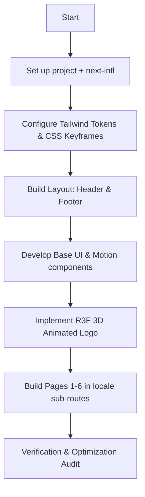

# Implementation Plan: Tripod Creative Digital Hub

This document defines the production implementation plan for converting the **Tripod Creative Agency** digital hub from the cinematic blueprint into a production-ready, highly interactive Next.js application.

---

## 1. Final Folder Structure

A standardized Next.js App Router structure with localized paths (`/[locale]`), centralized UI elements, data stores, and WebGL components.

```
tripod-creative/
├── public/
│   ├── assets/
│   │   ├── branding/           # Logos and branding files
│   │   ├── icons/              # SVG vectors
│   │   └── images/             # Compressed portfolio and studio images
│   └── locales/                # Static translations (if needed outside src)
├── src/
│   ├── app/
│   │   └── [locale]/           # next-intl routing wrapper
│   │       ├── layout.tsx      # Main wrapper with font variables
│   │       ├── page.tsx        # Home Page (localized: /en or /sw)
│   │       ├── about/
│   │       │   └── page.tsx    # About Us Page
│   │       ├── services/
│   │       │   └── page.tsx    # Services Page
│   │       ├── portfolio/
│   │       │   └── page.tsx    # Portfolio Masonry Page
│   │       ├── studio-academy/
│   │       │   └── page.tsx    # Music Studio & Academy Page
│   │       ├── contact/
│   │       │   └── page.tsx    # Contact & Booking Page
│   │       └── providers.tsx   # Client wrappers (Framer Motion, next-intl, reduced motion check)
│   ├── components/
│   │   ├── 3d/
│   │   │   ├── ThreeCanvas.tsx # WebGL Canvas container & lazy loader
│   │   │   └── TripodLogo.tsx  # React Three Fiber 3D mesh model
│   │   ├── ui/                 # Reusable glassmorphic UI elements
│   │   │   ├── GlassCard.tsx   # Card base with hover radial shine
│   │   │   ├── Button.tsx      # Interactive gradient/pill button
│   │   │   ├── InputField.tsx  # Forms elements
│   │   │   ├── Accordion.tsx   # FAQs drawer
│   │   │   └── ActivePulse.tsx # Dynamic indicator dot
│   │   ├── motion/             # Framer motion transition components
│   │   │   ├── ScrollReveal.tsx
│   │   │   ├── InfiniteMarquee.tsx
│   │   │   └── TiltWrapper.tsx # Desktop parallax tilt
│   │   └── shared/             # Layout sections
│   │       ├── Header.tsx      # TopNavBar
│   │       ├── Footer.tsx      # Footer System
│   │       └── LocaleSwitcher.tsx
│   ├── data/                   # JSON configurations for local arrays
│   │   ├── portfolio.ts
│   │   └── services.ts
│   ├── styles/
│   │   └── globals.css         # Styling, tailwind directives, custom keyframes
│   ├── types/
│   │   └── index.ts            # Type/Interface structures
│   ├── i18n.ts                 # next-intl settings
│   ├── middleware.ts           # URL rewrite mapping (EN/SW redirect)
│   └── navigation.ts           # next-intl navigation wrapper helpers
├── messages/                   # Translation directories
│   ├── en.json                 # English copy
│   └── sw.json                 # Swahili copy
├── tailwind.config.ts
├── tsconfig.json
└── package.json
```

---

## 2. Page-by-Page Implementation Plan



### Page 1: Home Page (`/en` or `/sw`)
*   **Path Mapping:** `app/[locale]/page.tsx`
*   **Routing Logic:** Root `/` redirects automatically to `/en` via middleware rewrite mapping.
*   **Key Sections:**
    1.  **Hero Block:** Dark backdrop housing the floating transparent 3D canvas and dynamic typography (`display-lg` scale overlays) responsive to viewports.
    2.  **Cinematic Showreel:** Wide responsive player utilizing a sleek thumbnail preview overlay and custom play trigger with glow-ring animations.
    3.  **Services Ecosystem:** 3-column overview card grid showing 6 core service categories (Branding, Production, Marketing, Photography, Drone, Music Studio).
    4.  **Why Choose Tripod:** Structured 2-column segment matching technical execution and speed metrics.
*   **Animations:** Smooth entry fade-ups, WebGL camera float, and hover card glow hotspots. Fallback static image/SVG used for mobile and reduced-motion states.

### Page 2: About Us Page (`/about`)
*   **Path Mapping:** `app/[locale]/about/page.tsx`
*   **Key Sections:**
    1.  **Tagline Intro:** Minimalist text statement ("Visual Storytellers") with a slow-drawing SVG timeline indicator.
    2.  **Mission & Vision:** Asymmetric split layout (1/3 description text vs 2/3 graphical lens showcase in high-elevation glass frame).
    3.  **Core Values Bento Grid:** Symmetrical 3-card array (Cinematic Excellence, Strategic Audacity, Radical Synergy). Card 2 offset downward on desktop using dynamic translation (`translate-y-12`) to disrupt standard layout symmetry.
    4.  **Methodology Timeline:** A horizontal connected sequence (Discover -> Strategy -> Execution -> Optimization) with custom linear path highlights.
    5.  **Creative Culture:** Clean grids containing grayscale images transforming to color on hover.
*   **Interactive Features:** Mouse-hover translation offsets, image transition filters.

### Page 3: Services Page (`/services`)
*   **Path Mapping:** `app/[locale]/services/page.tsx`
*   **Key Sections:**
    1.  **Header Segment:** Dynamic expertise subtitle + brand headline: "Where Vision Meets Cinematic Precision."
    2.  **Core Pillars:** High-fidelity overview cards detailing specific design processes.
    3.  **Hero Bento Card (Web & App Development):** Spans full 3 columns at the base, displaying software badges (React Native, SaaS, Cloud Scale) and dynamic navigation triggers.
    4.  **Atmospheric Contrast:** Split screen displaying structured service checkmarks alongside a glass overlay.

### Page 4: Portfolio Page (`/portfolio`)
*   **Path Mapping:** `app/[locale]/portfolio/page.tsx`
*   **Key Sections:**
    1.  **Hero Section:** Creative banner containing an active green-to-orange pulsating status beacon.
    2.  **Sticky Filter Navigation:** Pin-to-top layout to switch categories dynamically (All, Branding, Graphics, Printing, Photography, Video, Events, Music, Digital Campaigns) with smooth transitions.
    3.  **Masonry Grid:** Dynamic column sizing (`columns-1` mobile, `md:columns-2`, `lg:columns-3`) keeping uniform gaps. Items use different aspect ratios (`aspect-[4/5]`, `aspect-[1/1]`, `aspect-[16/9]`) to form a dynamic grid, fading-in card content on scroll.

### Page 5: Music Studio & Academy Page (`/studio-academy`)
*   **Path Mapping:** `app/[locale]/studio-academy/page.tsx`
*   **Key Sections:**
    1.  **Acoustic Hero:** Emissive waveform graphics, localized badges, and a floating studio mesh overlay.
    2.  **Studio Gear Bento Grid:** High-end bento showcasing equipment specifications, acoustic properties, and mixing desk arrays.
    3.  **Music Academy Block:** 2-column structure: Left houses mentoring values; Right hosts a staggered 2x2 grid representing courses (Piano, Guitar, Drums, Vocal) styled with asymmetrical heights.
    4.  **Infinite Marquee:** Continuous looping tape detailing key student benefits.

### Page 6: Contact & Booking Page (`/contact`)
*   **Path Mapping:** `app/[locale]/contact/page.tsx`
*   **Key Sections:**
    1.  **Contact Grid (12-Columns):**
        *   **Left (7 Columns):** Form container containing modern input fields (Name, Phone, Email, Services select) and project budget selectors tailored to TZS/Neutral metrics.
        *   **Right (5 Columns):** Instant WhatsApp consultation prompt card, email/phone contact panels using placeholders, and dynamic map placeholder box detailed as "Location details coming soon".
    2.  **FAQ System:** Accessible, smooth accordion selectors.
*   **Form Logic:** Phase 1 form runs strictly client-side with no backend. Submitting the form generates a pre-filled WhatsApp message based on input parameters and redirects to WhatsApp.

---

## 3. Component List

| Category | Component Name | Description | Key Props / Interaction |
| :--- | :--- | :--- | :--- |
| **Global** | `Header` | Sticky TopNavBar with blur and localization toggle. | `transparent: boolean` |
| | `Footer` | Dark footer containing terms, Instagram, and copyright. | None |
| | `LocaleSwitcher` | Text switch for EN / SW localized paths. | None |
| **UI** | `GlassCard` | Container with radial gradient hover spotlights. | `className`, `children` |
| | `Button` | Symmetrical pill with scale feedback and orange-gold gradient. | `variant: 'primary' \| 'secondary'`, `onClick` |
| | `InputField` | Labeled text/email input with animated borders. | `label`, `error`, `register` |
| | `Accordion` | FAQ item container with smooth height transitions. | `question`, `answer` |
| | `ActivePulse` | Pulsing animation indicator (e.g., green status light). | `color` (green/orange) |
| **Motion** | `ScrollReveal` | Transition container wrapping list entries. | `delay`, `direction` |
| | `InfiniteMarquee` | Seamless marquee using double CSS loops. | `speed`, `children` |
| | `TiltWrapper` | Desktop-only mouse-move parallax controller. | `intensity` |
| **WebGL** | `ThreeCanvas` | Client-only container loading 3D canvases. | `fallback` |
| | `TripodLogo3D` | Animated Torus + Cylindrical legs model (homepage hero only). | None |

---

## 4. Design Token Mapping

All variables defined in `DESIGN.md` will be directly mapped into standard Tailwind configurations and CSS variables.

### A. Colors (CSS & Tailwind Config)
```typescript
// tailwind.config.ts
const config = {
  theme: {
    extend: {
      colors: {
        background: '#111415',
        'body-bg-dark': '#000000',
        'surface-dim': '#111415',
        'surface-container': '#1d2021',
        'surface-container-lowest': '#0c0f10',
        'surface-container-low': '#191c1d',
        'surface-container-high': '#282a2b',
        'surface-container-highest': '#323536',
        primary: {
          DEFAULT: '#ffb688',
          container: '#ff7e00',
        },
        secondary: {
          DEFAULT: '#fff0c8',
          container: '#fdd000',
          fixed: '#ffe07c',
        },
        'on-surface': '#e1e3e4',
        'on-surface-variant': '#dfc0af',
        outline: {
          DEFAULT: '#a78b7b',
          variant: '#584235',
        }
      },
      backgroundImage: {
        'brand-gradient': 'linear-gradient(90deg, #ffb688 0%, #fdd000 100%)',
        'hot-spot': 'radial-gradient(circle at top left, rgba(255, 182, 136, 0.08) 0%, transparent 70%)',
      }
    }
  }
}
```

### B. Typography Config
*   **Fonts:**
    *   Display/Headings: `var(--font-montserrat)` (Montserrat)
    *   Body Copy: `var(--font-inter)` (Inter)
    *   Technical/Metadata: `var(--font-geist)` (Geist Sans or Geist Mono)

```css
/* src/styles/globals.css */
@layer utilities {
  .display-lg {
    font-family: var(--font-montserrat);
    font-size: clamp(2rem, 5vw, 4.5rem); /* Responsive 32px to 72px */
    font-weight: 800;
    line-height: 1.1;
    letter-spacing: -0.04em;
  }
  .headline-lg {
    font-family: var(--font-montserrat);
    font-size: clamp(2rem, 4vw, 3rem); /* Responsive 32px to 48px */
    font-weight: 700;
    line-height: 1.15;
    letter-spacing: -0.02em;
  }
  .label-md {
    font-family: var(--font-geist);
    font-size: 0.875rem;
    font-weight: 500;
    letter-spacing: 0.05em;
  }
}
```

### C. Layout Elements
*   **Grid Gutter:** `gap-6` (`24px`)
*   **Mobile Margin:** `px-5` (`20px`)
*   **Desktop Margin:** `px-16` (`64px`)
*   **Section Spacing:** `py-[120px]` (standardizing spacing between page sections)

---

## 5. Animation Strategy

We will use Framer Motion for UI-level scroll triggers and React Three Fiber (R3F) for WebGL scene rendering.

### A. Framer Motion Setup
*   **Scroll Reveal Hook:** We will implement simple wrappers utilizing `useInView` to avoid heavy performance overhead.
*   **Hover Perspective Tilt (Desktop):**
    ```typescript
    // Custom wrapper tracking client coordinates and outputting transform variables:
    // rotateX = ((y - height/2) / height) * -intensity
    // rotateY = ((x - width/2) / width) * intensity
    ```
*   **Float keyframes (CSS fallback to avoid JS threads):**
    ```css
    @keyframes float {
      0%, 100% { transform: translateY(0); }
      50% { transform: translateY(-10px); }
    }
    .animate-float {
      animation: float 6s ease-in-out infinite;
    }
    ```

### B. Three.js Logo Animation Details (Homepage Hero Only)
To render the core Tripod logo cleanly:
1.  **Canvas Setup:** Translucent wrapper with transparency enabled.
2.  **Central Ring (Phong Material):**
    *   Geometry: `THREE.TorusGeometry(1, 0.05, 16, 100)`
    *   Material: `MeshPhongMaterial` with `#ff7e00` color, specular highlight, and emissive setting matching target colors.
3.  **Tripod Legs:**
    *   Three Cylinders (`THREE.CylinderGeometry(0.05, 0.05, 2.5, 8)`) offset at 120-degree divisions on Y-axis.
4.  **Floating mesh elements:** Cylinders, Spheres, Cubes circling the central group in randomized phases.
5.  **Reduced Motion & Mobile Optimization:** Disable WebGL completely on mobile viewports and reduced-motion states. Instead, fallback immediately to static SVG/image assets.

---

## 6. Localization Strategy (next-intl)

Using the Next.js middleware strategy with App Router to support localized `/en` and `/sw` prefixes.

### A. Middleware Configuration
```typescript
// src/middleware.ts
import createMiddleware from 'next-intl/middleware';
import { locales, defaultLocale } from './navigation';

export default createMiddleware({
  locales,
  defaultLocale,
  localePrefix: 'always'
});

export const config = {
  // Match layout pages and API paths
  matcher: ['/', '/(sw|en)/:path*', '/((?!_next|_vercel|.*\\..*).*)']
};
```

### B. Dictionary Structure
Example setup inside `messages/` translations:
```json
// messages/en.json
{
  "Navigation": {
    "home": "Home",
    "about": "About",
    "services": "Services",
    "portfolio": "Portfolio",
    "music": "Studio & Academy",
    "contact": "Contact"
  },
  "Home": {
    "heroTitle": "Cinematic Prism Production",
    "heroSubtitle": "Visual excellence built with future-proof tech."
  }
}
```

```json
// messages/sw.json
{
  "Navigation": {
    "home": "Mwanzo",
    "about": "Kuhusu",
    "services": "Huduma",
    "portfolio": "Kazi Zetu",
    "music": "Studio na Chuo",
    "contact": "Mawasiliano"
  },
  "Home": {
    "heroTitle": "Uzalishaji wa Cinematic Prism",
    "heroSubtitle": "Ubora wa picha ulioundwa na teknolojia ya kisasa."
  }
}
```

---

## 7. Portfolio Data Structure

Portfolio items must fit varying grid shapes and categories cleanly.

```typescript
// src/types/index.ts
export type PortfolioCategory =
  | 'branding'
  | 'graphics'
  | 'printing'
  | 'photography'
  | 'video'
  | 'events'
  | 'music'
  | 'digital-campaigns';

export interface PortfolioItem {
  id: string;
  title: {
    en: string;
    sw: string;
  };
  description: {
    en: string;
    sw: string;
  };
  category: PortfolioCategory;
  thumbnailUrl: string;
  aspectRatio: 'aspect-[4/5]' | 'aspect-[1/1]' | 'aspect-[16/9]';
  tags: string[];
}
```

---

## 8. Services Data Structure

```typescript
// src/types/index.ts
export interface ServicePillar {
  id: string;
  title: {
    en: string;
    sw: string;
  };
  description: {
    en: string;
    sw: string;
  };
  iconName: string; // Material Symbols keyword
  bullets: {
    en: string[];
    sw: string[];
  };
  pills?: string[]; // E.g. Tech details
}
```

---

## 9. WhatsApp Booking Strategy

To support immediate client conversion across East Africa:
1.  **Format Rule:** Use the international routing format for Tanzania (`+255`) or general placeholder `[WhatsApp Phone Number Placeholder]`.
2.  **Form Backend Architecture (Phase 1):** Sessional contact forms run strictly client-side. The submit handler compiles form parameters, generates the custom URL, and triggers redirect to WhatsApp (`https://wa.me/...`). No backend server, database, or API request exists in Phase 1.
3.  **Redirection Helper:**
    ```typescript
    export function generateWhatsAppLink(params: {
      name: string;
      service: string;
      budget: string;
      language: 'en' | 'sw';
    }) {
      const base = `https://wa.me/${process.env.NEXT_PUBLIC_WHATSAPP_NUMBER || '255XXXXXXXXX'}`;
      
      const message = params.language === 'sw'
        ? `Habari Tripod! Jina langu ni ${params.name}. Ningependa kuweka nafasi ya huduma ya "${params.service}" yenye kiwango cha bajeti ya ${params.budget}.`
        : `Hello Tripod! My name is ${params.name}. I'd like to book a session for "${params.service}" with an estimated project size of ${params.budget}.`;
        
      return `${base}?text=${encodeURIComponent(message)}`;
    }
    ```
4.  **Tanzania-Friendly Budget Fields:**
    *   **Under TZS 5M** (Starter / Local Brand Setup)
    *   **TZS 5M - 15M** (Growth / SME Production)
    *   **TZS 15M - 50M** (Premium Agency / Corporate Campaign)
    *   **TZS 50M+** (Enterprise / Cinematic Production Scale)

---

## 10. SEO Strategy

1.  **Next.js Metadata API:** Configured dynamically at layout/page levels.
2.  **Alternate Language Configuration:** Alternate markup headers pointing search engines to matching language pages:
    ```typescript
    // metadata config template:
    const baseUrl = process.env.NEXT_PUBLIC_SITE_URL || 'http://localhost:3000';
    
    export const metadata = {
      alternates: {
        canonical: `${baseUrl}/en/services`,
        languages: {
          'en-US': `${baseUrl}/en/services`,
          'sw-TZ': `${baseUrl}/sw/services`,
        },
      }
    };
    ```
3.  **JSON-LD Schema Integration:** Generates localized structure markup:
    ```json
    {
      "@context": "https://schema.org",
      "@type": "ProfessionalService",
      "name": "Tripod Creative Agency",
      "image": "NEXT_PUBLIC_SITE_URL/logo.png",
      "url": "NEXT_PUBLIC_SITE_URL",
      "sameAs": [
        "https://www.instagram.com/tripodcreative_/?hl=en"
      ]
    }
    ```

---

## 11. Performance Optimization Checklist

*   [ ] **Dynamic WebGL Imports:** Wrap 3D elements using `next/dynamic` to avoid blocking core page rendering thread.
*   [ ] **Next/Image Optimization:** Force modern formats (WebP/AVIF), set layout heights, and enable `priority` parameters for hero frames.
*   [ ] **Google Font Optimization:** Configure font variables directly in layout via `next/font/google` to reduce layout flashes and load styles locally.
*   [ ] **Static Generation:** Keep pages statically compiled where possible (`output: 'export'` or Incremental Static Regeneration) to minimize server load.

---

## 12. Risk Register and Fixes

| Risk | Impact | Fix |
| :--- | :--- | :--- |
| **WebGL Performance Overhead** | Heavy processor load on low-spec mobile viewports. | Disable active canvas rotation on screens `<768px`; swap R3F scene with static SVG graphic vector fallback. |
| **Hydration Failures** | UI crashes due to system mismatch or localized date-formatting differences. | Ensure translations utilize exact matching static text structures; configure client components to mount after runtime checks. |
| **Asset Size Latency** | Slow loading speeds over mobile data connections. | Apply strict compression pipelines (AVIF format) to all site assets and delay showreel load triggers. |

---

## 13. Accessibility (a11y) & Reduced-Motion Blueprint

To ensure proper standards of digital accessibility:

### A. Semantic Heading Hierarchy
*   Each page must contain a single `<h1>` representing the main topic.
*   Section dividers must utilize sequential `<h2>` elements.
*   Sub-level grid labels and card summaries must utilize `<h3>` elements to maintain screen-reader hierarchy.

### B. Keyboard Navigation & Visible Focus
*   All interactive elements (buttons, inputs, language selectors) must be focusable using keyboard navigation (`Tab` keys).
*   Visual focus indicator rings are styled using Tailwind's `focus-visible` classes:
    `focus-visible:outline-none focus-visible:ring-2 focus-visible:ring-primary focus-visible:ring-offset-2 focus-visible:ring-offset-background`
*   Forms must support `Enter` submit actions.

### C. ARIA Attributes
*   Icon-only triggers (such as menu bars, filter controls, or social networks) must incorporate explicit descriptive attributes:
    `aria-label="Toggle language menu"`, `aria-label="Open Instagram Profile"`, etc.
*   SVG assets must be styled with `aria-hidden="true"` if they are decorative.

### D. Form Labeling
*   Input fields must link directly to their matching text label using proper semantic syntax:
    ```tsx
    <label htmlFor="client-name" className="label-md">Name</label>
    <input id="client-name" name="name" type="text" ... />
    ```

### E. Prefers-Reduced-Motion Handling
*   **Framer Motion Integration:** Enable Framer Motion's `useReducedMotion()` hook globally or within individual components to substitute all complex translations/scales with immediate opacity fades.
*   **CSS Fallback:** Disable hover transitions, scrolls, and keyframe loops inside stylesheet rules:
    ```css
    @media (prefers-reduced-motion: reduce) {
      * {
        animation-delay: -1ms !important;
        animation-duration: 1ms !important;
        animation-iteration-count: 1 !important;
        background-attachment: scroll !important;
        scroll-behavior: auto !important;
        transition-duration: 0s !important;
        transition-delay: 0s !important;
      }
    }
    ```
